# Face generation using a Deep Convolutional Generative Adversarial Network (DCGAN)

## Getting started

1. clone this repository
2. install dependencies (Tensorflow version >= 1, numpy, python 3, jupyter notebook)
3. cd extracted directory
4. open your favorite terminal (ie git bash)
5. $ -> `jupyter notebook` expected behavior  -> a browser window should open with the notebook home directory
6. select `dlnd_face_generation.ipynb`
7. press `shift` + `tab` on each cell to run through the notebook

# Explorations

## Exploration of beta1

beta1 is a learning rate momentum parameter for the Adam () optimizer that effects learning rate decay.

> "Decaying \beta_{1,t} towards zero is important in our theoretical analysis and also matches previous empirical findings, e.g. (Sutskever et al., 2013) suggests reducing the momentum coefficient in the end of training can improve convergence."

While typically this is set to .9 [ie see Keras's implementation), it would appear from tests below that for this GAN network .5 works better.
In the first example, set with `beta = .5` we observe convergence of *G()* and *D()*. Where as in the chart below, we see much slower convergence. Therefore within the scope of this proejct and training examples available we keep it to .5.

` mnist-beta1 = `

| 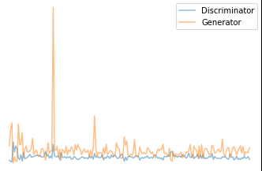 | 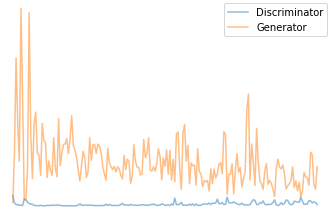|
|:---:|:---:|
| `.5 `  Better loss convergence | `.9`|

` faces-beta1 = `

|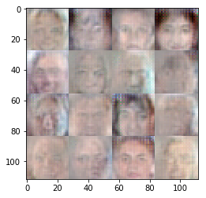|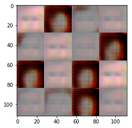 |
|:---:|:---:|
| `.5 ` Better result | `.9`|

## Exploration of noise and standard deviation

In [Wasserstein GAN](https://arxiv.org/pdf/1701.07875.pdf) it's mentioned that

> "...the optimal standard deviation of the noise added to the
model when maximizing likelihood is around 0.1 to each pixel in a generated image,
when the pixels were already normalized to be in the range [0, 1]."

in reference to [this paper](https://arxiv.org/pdf/1611.04273.pdf).

I tested a mean of 0 and both .1 and .2 to see the effect: `noise-std = `
Below is the last image of 1 epoch. I would say .2 looks better:

| 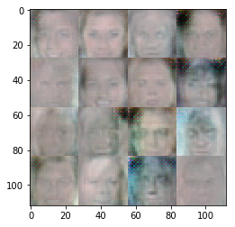| |
|:---:|:---:|
| `.1 ` | ` .2 `|

However if we look at say an early stopping result at .1, the results are more mixed:

` noise-std = .1  early stopping`
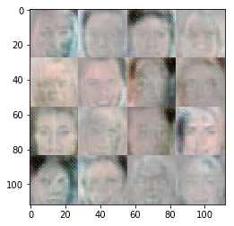

## Exploration of network size

Some interesting result were had with larger networks and networks of varying size. For example, here  *D()* was larger in respect to *G()*, with poor results.
Generally it would appear that *D()* should be ~= to *G()*

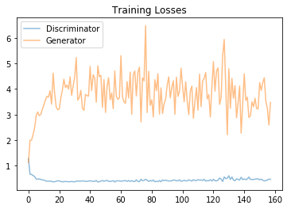

| 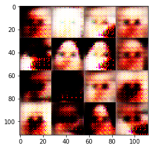|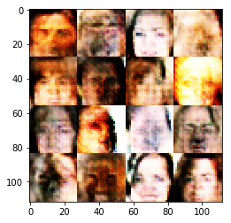 |
|:---:|:---:|
|With various experiments in network size, some rather scary results were had | I was able to get more colour representation, however the network typically seemed less stable while doing so.|

## Exploration of Learning rate

| 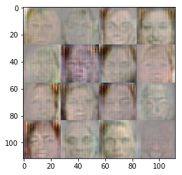| 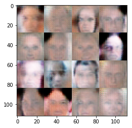 |  |
|:---:|:---:|:---:|
| 1e-4 | 2e-4 | 3e-4 |

It would appear 3e-4 gave the most realistic results.
2e-4 seems slightly more accurate, however the colour in 3e-4 is better.

## Exploration of Alpha

| 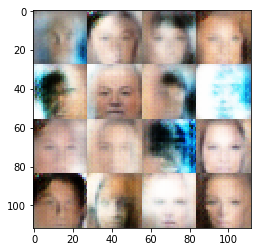| 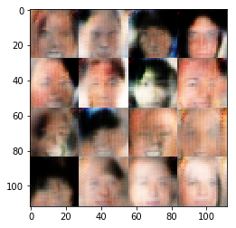 | 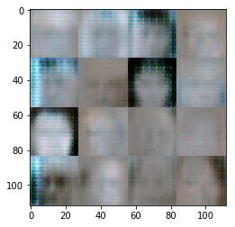 |
|:---:|:---:|:---:|
| 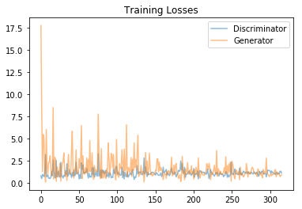| 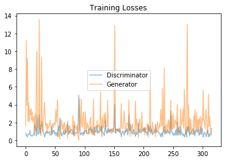 | 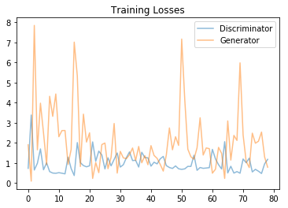 |
| .1 | .2 | .3 |

I would argue the loss at .1 is the winner based on more reasonable convergence.
Visually .1 and .2 seem fairly similar.

## Best results

### Mnist
| 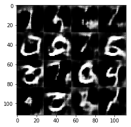 | 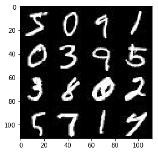 |
|:---:|:---:|
| Generated | Real |

### Faces

|  | 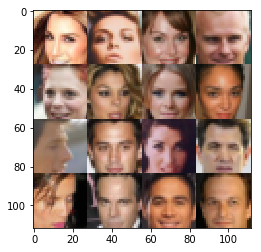 |
|:---:|:---:|
| Generated | Real |

# Closing thoughts

Clearly there is a large room for improvement.

Next I would like to try implementing this with an [Improved Wasserstien GAN](https://github.com/wiseodd/generative-models/blob/master/GAN/improved_wasserstein_gan/wgan_gp_tensorflow.py).

A lot of yet to be answered questions, for example I would like a deeper understanding of:
- how does z_dim effect results?
- convolutional transpose operations

And much much more... :)